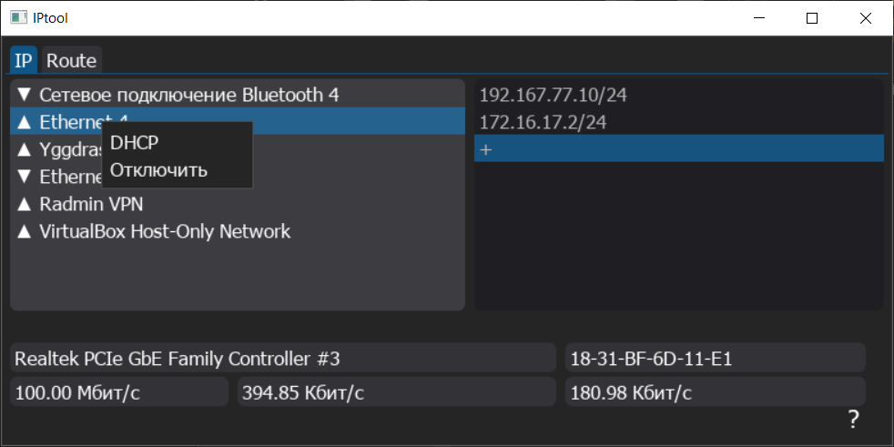

# IPtool

Инструмент для просмотра и конфигурирования параметров сетевых интерфейсов windows

[*Скачать тут*](https://github.com/Dima5iK/iptool/releases)

## Возможности

- Управление сетевыми интерфейсами (включение/отключение, настройка DHCP).
- Добавление и удаление IP-адресов.

## Интерфейс

